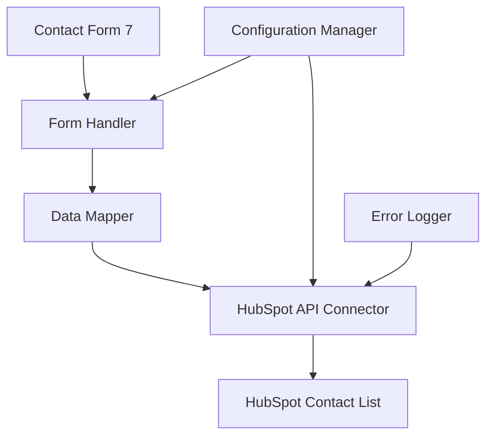
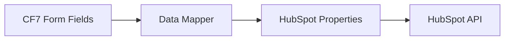
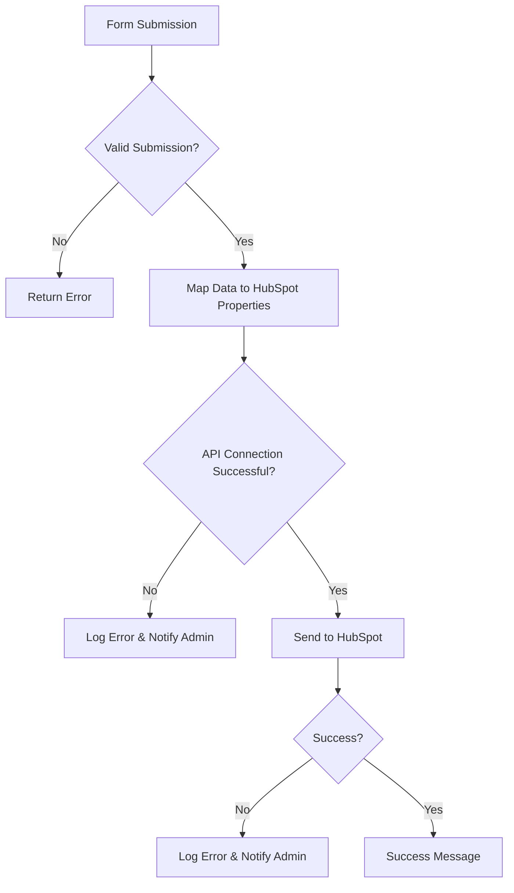

# Technical Specification: Contact Form 7 to HubSpot Integration Plugin

## 1. Introduction

### 1.1 Purpose
This document outlines the technical specification for a WordPress plugin that integrates Contact Form 7 with HubSpot using the HubSpot API. The plugin captures form submissions and sends the data to a specified HubSpot contact list.

### 1.2 Scope
This plugin will:
- Capture form submissions from Contact Form 7
- Map form fields to HubSpot contact properties
- Send contact data to a specified HubSpot contact list
- Handle API authentication and error management
- Provide configuration interface for administrators

### 1.3 Intended Audience
- WordPress developers
- Site administrators
- HubSpot integration specialists
- Plugin maintainers

## 2. System Architecture

### 2.1 Overview
The plugin follows a modular architecture with the following components:
- Configuration Manager
- Form Handler
- HubSpot API Connector
- Data Mapper
- Error Logger

### 2.2 Component Diagram

### 2.3 Technology Stack
- PHP 7.4+
- WordPress 5.0+
- Contact Form 7 5.0+
- HubSpot API v3
- RESTful API principles

## 3. Requirements

### 3.1 Functional Requirements
- FR-1: The plugin shall capture all form submissions from Contact Form 7
- FR-2: The plugin shall map form field values to HubSpot contact properties
- FR-3: The plugin shall send contact data to a configurable HubSpot contact list
- FR-4: The plugin shall authenticate with HubSpot using API tokens
- FR-5: The plugin shall provide configuration options for API keys and contact lists
- FR-6: The plugin shall log all API interactions for debugging purposes
- FR-7: The plugin shall handle API errors gracefully with user-friendly messages

### 3.2 Non-functional Requirements
- NR-1: Performance: Plugin should not significantly impact form submission speed
- NR-2: Security: All API credentials must be securely stored
- NR-3: Reliability: Plugin should handle network timeouts gracefully
- NR-4: Maintainability: Code should be well-documented and modular

## 4. Data Flow

### 4.1 Submission Process
1. User submits a Contact Form 7 form
2. Form handler intercepts the submission
3. Form data is validated and sanitized
4. Data mapper transforms form fields to HubSpot properties
5. API connector sends data to HubSpot
6. Response is logged and errors handled appropriately

### 4.2 Data Mapping

### 4.3 Error Handling Flow

## 5. Integration Points

### 5.1 Contact Form 7 Integration
- Hook into `wpcf7_submit` action
- Listen for form submission events
- Access form data through CF7 hooks

### 5.2 HubSpot API Integration
- **Authentication**: OAuth 2.0 or API Key
- **Endpoints**:
  - POST /contacts/v1/contact (create contact)
  - POST /contacts/v1/lists/{listId}/subscribe (add to list)
- **Rate Limits**: Respect HubSpot API rate limits
- **Version**: HubSpot API v3

### 5.3 Configuration Interface
- WordPress admin menu integration
- Settings page for API credentials
- Contact list selection dropdown
- Field mapping configuration

## 6. Configuration and Settings

### 6.1 Plugin Settings
- HubSpot API Key
- Default Contact List ID
- Enable/Disable Logging
- Debug Mode Toggle

### 6.2 Field Mapping
- Map CF7 form fields to HubSpot contact properties
- Support for custom properties
- Validation rules for mapped fields

### 6.3 UI Components
- Settings page with tabbed interface
- Form field mapping table
- Test connection button
- Save configuration button

## 7. Implementation Details

### 7.1 Core Classes
- `HubSpotIntegrationPlugin` - Main plugin class
- `HubSpotApiClient` - Handles API communications
- `FormSubmissionHandler` - Processes form submissions
- `DataMapper` - Maps form fields to HubSpot properties
- `SettingsManager` - Manages plugin configuration

### 7.2 Database Considerations
- No database tables required
- All settings stored in WordPress options table
- Logs stored in transient or custom log file

### 7.3 Security Considerations
- API keys stored in encrypted format
- Input validation and sanitization
- CSRF protection for admin forms
- Role-based access control

## 8. Error Handling and Logging

### 8.1 Error Categories
- Authentication errors
- Network connectivity issues
- Invalid API responses
- Configuration errors

### 8.2 Logging Mechanism
- Log file storage in wp-content/uploads/
- Log levels: DEBUG, INFO, WARNING, ERROR
- Log retention policy (30 days)

## 9. Testing Strategy

### 9.1 Unit Tests
- Data mapping validation
- API client functionality
- Configuration validation

### 9.2 Integration Tests
- End-to-end form submission flow
- API interaction testing
- Error scenario simulation

## 10. Deployment and Maintenance

### 10.1 Installation
- Standard WordPress plugin installation
- Activation via WordPress admin panel
- Initial configuration setup

### 10.2 Updates
- Automatic update checking
- Version compatibility verification
- Backup procedures for configuration

## 11. Future Enhancements

### 11.1 Planned Features
- Support for custom HubSpot properties
- Webhook integration for advanced workflows
- Multi-list subscription capability
- Advanced field mapping rules
- Batch processing for high-volume forms

### 11.2 Performance Improvements
- Caching of HubSpot API responses
- Async processing for large form submissions
- Improved error recovery mechanisms

## 12. Conclusion
This technical specification provides a comprehensive blueprint for developing a robust Contact Form 7 to HubSpot integration plugin. The modular architecture ensures maintainability and scalability while the detailed requirements guarantee proper functionality and security.